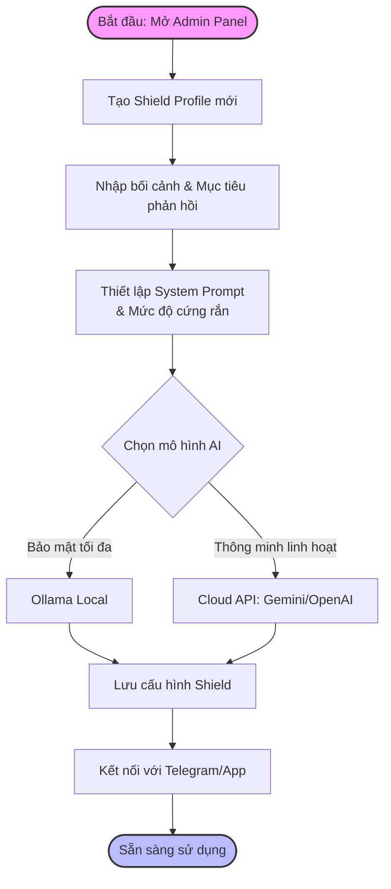
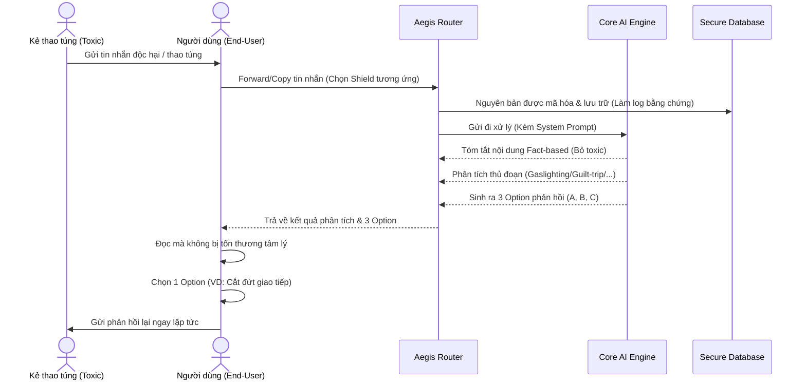

# 🛡️ PRODUCT CONCEPT: NỀN TẢNG TRỢ LÝ AI BẢO VỆ TÂM LÝ DÀNH CHO CÁ NHÂN (AEGIS AI PLATFORM)

> **Định hướng:** Một nền tảng AI mã nguồn mở / self-hosted, cho phép người dùng tự do tùy biến thành các "Lá chắn" (Shields) để đối phó với các luồng giao tiếp độc hại trong nhiều ngữ cảnh khác nhau (gia đình, công sở, mạng xã hội...).

---

## 💡 ĐỊNH VỊ SẢN PHẨM

**Tên sản phẩm:** Aegis AI Platform (Nền tảng Lá chắn AI)
**Tagline:** *"Bảo vệ ranh giới cảm xúc của bạn. Tùy biến cho mọi ngữ cảnh."*
**Định vị:** Một nền tảng trung gian giao tiếp (Communication Intermediary Platform) tập trung vào Quyền riêng tư (Privacy-first). Aegis tiếp nhận các tin nhắn thô, tiêu hóa cảm xúc tiêu cực và đưa ra các giải pháp phản hồi ứng xử theo nguyên tắc do chính người dùng thiết lập.

---

## 🎯 GIÁ TRỊ CỐT LÕI (Core Value Proposition)

### 1. Kiến trúc "Đa Lá Chắn" (Multi-Shield Architecture)

Thay vì hardcode vào một tình huống cố định, hệ thống cho phép tạo ra nhiều "Shield" khác nhau thông qua việc quản lý System Prompt. Ví dụ:

- **Shield 1:** Đối phó người yêu/chồng/vợ cũ độc hại (Chiến thuật "Grey Rock").
- **Shield 2:** Đối phó sếp/đồng nghiệp thao túng tâm lý (Gaslighting) (Chiến thuật: Chuyên nghiệp, vịn vào quy trình, không cảm xúc).
- **Shield 3:** Đối phó khách hàng/đối tác hách dịch (Chiến thuật: Mềm mỏng nhưng kiên quyết bảo vệ hợp đồng).

### 2. Bộ lọc Cảm xúc & Giải mã ý đồ (Emotional Buffer & Intent Decryption)

Phân tách "Nội dung thực tế" và "Độc chất cảm xúc".
Dù tin nhắn gốc có dài và mang tính công kích bôi nhọ đến đâu, bot sẽ biên dịch lại bằng giọng văn trung lập, tập trung vào sự kiện (Fact-based summary) và vạch trần thủ đoạn tâm lý đằng sau (VD: "Họ đang dùng cảm giác tội lỗi để ép bạn đồng ý").

### 3. Động cơ Phản hồi Tùy chỉnh (Generative Response Engine)

Luôn đưa ra các lựa chọn phản hồi theo định hướng của người dùng. Hệ thống có thể sinh ra các tùy chọn như:

- Option A: Chấm dứt giao tiếp (Boundary setting).
- Option B: Nhượng bộ một phần nhưng có điều kiện (Conditional agreement).
- Option C: Phản hồi mang tính pháp lý/ghi nhận bằng chứng (Legal/Formal).

### 4. Chủ quyền dữ liệu tuyệt đối (Absolute Data Sovereignty)

Bởi vì dữ liệu đưa vào là các góc khuất cá nhân nhạy cảm nhất, nền tảng được thiết kế mặc định để tự host (Local/VPS cá nhân). Người dùng có toàn quyền chọn LLM (chạy Ollama nội bộ để bảo mật 100%, hoặc gọi API có cam kết Zero-Data-Retention).

### 5. Học tăng cường & Khắc họa chân dung tâm lý (Reinforcement Learning & Psychological Profiling)

Hệ thống không hoạt động một chiều. Người dùng có thể cập nhật "kết quả thực tế" (reaction của đối tượng) sau khi áp dụng lời khuyên. Qua vòng lặp phản hồi (Feedback Loop), AI sẽ lưu trữ, phân tích mẫu hành vi (Behavioral Patterns) và xây dựng chân dung tâm lý của đối tượng. Nhờ đó, chất lượng tư vấn, tính dự báo và độ sắc bén trong các phản hồi sẽ liên tục "tiến hóa" sát với thực tế nhất.

---

## 🔄 LUỒNG NGƯỜI DÙNG (User Flows)

Hệ thống được vận hành qua 3 luồng chính để đảm bảo tính khép kín từ khâu thiết lập, sử dụng hàng ngày đến việc học tập hành vi.

### 1. Luồng Thiết lập (Onboarding & Shield Configuration)

Đây là luồng dành cho Admin (hoặc người hỗ trợ gia đình) để tạo ra các "Lá chắn" (Shield profile) nhằm đối phó với từng đối tượng cụ thể.



### 2. Luồng Xử lý Tin nhắn (Core Message Filtering)

Luồng sử dụng hàng ngày của người được bảo vệ (End-User). Hệ thống đứng ra làm vùng đệm cảm xúc an toàn.



### 3. Luồng Học tập & Nâng cao (Feedback Loop & Profiling)

Sau khi phản hồi, người dùng cung cấp thông tin về phản ứng tiếp theo của mục tiêu để hệ thống tự động tinh chỉnh.

```mermaid
flowchart TD
    A([Sau khi User phản hồi Toxic]) --> B[Đối tượng phản ứng lại \n(VD: Nổi điên / Im lặng)]
    B --> C[User nhập kết quả vào Aegis \n'Cập nhật kết quả']
    C --> D[Phân tích mức độ hiệu quả \ncủa Option đã chọn]
    D --> E[(Database: Cập nhật \nHồ sơ hành vi)]
    E --> F[Tinh chỉnh System Prompt \nvà Chiến thuật phòng vệ]
    F --> G[Gửi tin nhắn an ủi \n(Aftercare) cho User]
    G --> H([Hoàn tất vòng lặp])
  
    style A fill:#f9f,stroke:#333,stroke-width:2px
    style E fill:#f9db57,stroke:#333,stroke-width:2px
    style H fill:#bbf,stroke:#333,stroke-width:2px
```

---

## 🗂️ TÍNH NĂNG CHÍNH (Key Features)

1. **Dashboard Quản lý Nhân cách (Persona Dashboard):** Giao diện web đơn giản để gia đình/nhà phát triển cấu hình các System Prompt, thiết lập giới hạn và điều chỉnh "độ cứng rắn" của bot.
2. **Kho bằng chứng tự động (Blackbox Logger):** Tự động lưu trữ nguyên bản mọi tin nhắn thô, phân loại theo nhãn mác và đối tượng. Có khả năng xuất bản báo cáo PDF (kèm timestamp) đạt chuẩn làm bằng chứng pháp lý khi cần.
3. **Module Chăm sóc tâm lý (Aftercare Module):** Tự động cung cấp các câu affirmation (khẳng định tích cực), nhắc nhở người dùng về giá trị bản thân sau khi họ vừa phải xử lý một tương tác độc hại.
4. **Hệ thống cảnh báo rủi ro (Threat Detection):** Cảnh báo ngay lập tức mức độ bạo lực, đe dọa thể chất hoặc tống tiền trong tin nhắn gốc để người dùng có biện pháp phòng vệ kịp thời thay vì chỉ phản hồi tin nhắn.
5. **Động cơ học tập hành vi (Reinforced Profiling Engine):** Cho phép người dùng feedback lại diễn biến câu chuyện. Động cơ này tự động phân tích và bổ sung thông tin vào "Hồ sơ đối tượng", giúp cá nhân hóa cực sâu cho từng đối tượng (VD: Biết đối tượng hay dùng chiêu trò dọa tự tử → Hệ thống tự prep sẵn cách từ chối lạnh lùng và hướng dẫn báo cảnh sát 113).

---

## 🏗️ KIẾN TRÚC HỆ THỐNG ĐỀ XUẤT CHO NỀN TẢNG CAO CẤP

Để đảm bảo tính "Có thể tùy biến" (Customizable) và "Bảo mật" (Secure):

- **Giao diện cấu hình (Admin Panel):** Next.js hoặc React — dùng để setup Prompt, API Keys, quản lý log. (Chỉ chạy rớt mạng nội bộ hoặc qua VPN cá nhân).
- **Giao diện sử dụng (Client):** Tích hợp qua các bot nhắn tin (Telegram, Discord) hoặc một Web App PWA thân thiện trên điện thoại để dễ copy/paste.
- **Backend Core:** Node.js (NestJS) hoặc Python (FastAPI). Kiến trúc Modular để dễ dàng nâng cấp các Plugins (Plugin log bằng chứng, Plugin tóm tắt pháp lý,...).
- **Database:** SQLite (cho sự đơn giản local) hoặc PostgreSQL (nếu deploy lên private server).
- **LLM Integration Layer:** Module middleware hỗ trợ hot-swap (chuyển đổi nóng) giữa các model:
  - Local AI (Ollama + Llama 3 / Qwen) cho dữ liệu cấp độ "Tuyệt mật".
  - Cloud API (Gemini / Claude / OpenAI) cho các tác vụ cần thông minh xuất sắc nhưng độ nhạy cảm vừa phải.

---

## 📈 TẦM NHÌN SẢN PHẨM (Vision)

Aegis không chỉ là một con bot rep tin nhắn. Nó là một **"Hạ tầng sức khỏe tâm trí"** cho các gia đình và cá nhân.
Từ bài toán của gia đình bạn, khi nền tảng cốt lõi được xây dựng chuẩn mực, nó có thể được đóng gói thành một giải pháp phần mềm mở (Open-source) để chia sẻ cho các tổ chức bảo vệ phụ nữ, bảo vệ người lao động, hoặc bất kỳ ai đang cần một chiếc "Lá chắn cảm xúc" trên môi trường số.
